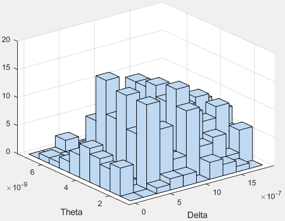
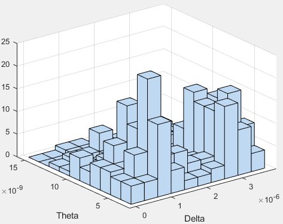
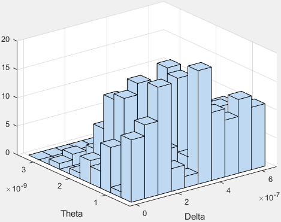
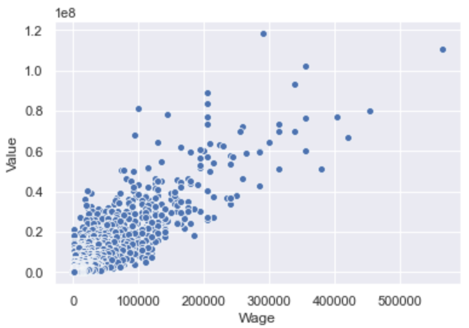

# Data Science Portfolio

# [Project 1 (ongoing): Lab Work](https://github.com/mcooper98/lab_work)
* Created various statistical representations using data from subjects Choco20, Drag12, and Drag13 data to determine the most accurate representation for use by an unsupervised machine learning model

*Goal of model is to optimize the configuration of a neurological implant

*Built machine learning algorithms in both Python and MATLAB

*Handled migration from Google Colab to MATLAB which required restructuring of our codebase

2D Kernel Density Estimations using Theta and Delta waves

# [Project 2: Iris Flower](https://github.com/mcooper98/iris_flower)
* Machine learning model used to predict particular species of the iris flower via input data
* Model is trained on the Iris flowert data set. 

# [Project 3: Soccer Player Wages vs Values](https://github.com/mcooper98/Soccer_wage_vs_value)
* By cleaning and reformatting the wages and values columns from a database listing all current professional soccer playters I created a scatter plot with x,y as (wages, value) in order to determine which players are overvalued or undervalued. 
* Created an additional column that listed the difference of value - wage for each player in order to quantify the magnitute of their evaluations. 

